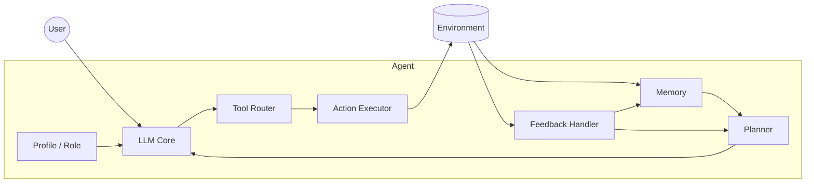
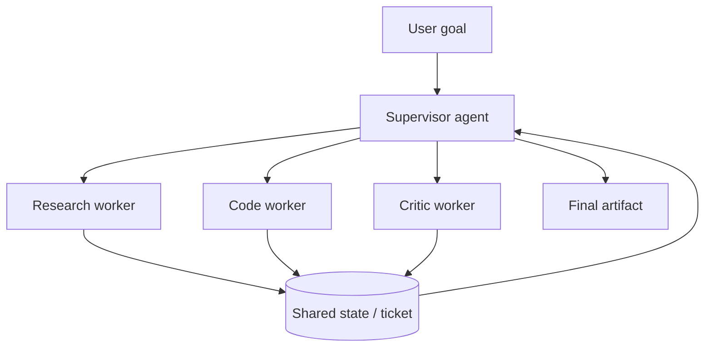

# AI Agents: A Deep, Practical Guide for People Who Already Know LLMs

**Subtitle:** From chatbots to autonomous systems — architecture, research, math, and code, step by step.

> **Medium tip:** Paste section headings as **H2** blocks. Medium does not honor Markdown anchor links reliably; use the **“At a glance”** list as your scroll map.

---

## At a glance — what you will understand after this article

- **What an agent is** (and what it is not) compared to a chatbot or RAG assistant.
- **The canonical loop:** perceive → plan → act → observe → remember → reflect.
- **Foundational research:** ReAct, Toolformer, Reflexion, Generative Agents, Tree of Thoughts, and modern surveys.
- **The three pillars** most 2024–2025 surveys agree on: **tool use**, **planning**, **feedback / memory**.
- **Light math** that makes papers readable: policies, expectations, softmax tool choice, search over reasoning trees.
- **Multi-agent systems**, evaluation benchmarks, and **production realities** (cost, safety, loops, observability).
- **A minimal ReAct implementation** you can run locally (`examples/minimal_react_agent.py`).

**Prerequisite:** you have used an LLM API or ChatGPT, know what a **prompt** and **token** are, and have heard of **embeddings** or **RAG**. That is enough.

---

## Table of contents

1. [Step 0 — What you already know about LLMs (and why it is not enough)](#step-0--what-you-already-know-about-llms-and-why-it-is-not-enough)
2. [Step 1 — What is an AI agent?](#step-1--what-is-an-ai-agent)
3. [Step 2 — Chatbot vs assistant vs agent vs autonomous agent](#step-2--chatbot-vs-assistant-vs-agent-vs-autonomous-agent)
4. [Step 3 — A short history: from symbols to language models](#step-3--a-short-history-from-symbols-to-language-models)
5. [Step 4 — Agent anatomy: the seven modules](#step-4--agent-anatomy-the-seven-modules)
6. [Step 5 — The agent loop as a control system](#step-5--the-agent-loop-as-a-control-system)
7. [Step 6 — Math you actually need (no PhD required)](#step-6--math-you-actually-need-no-phd-required)
8. [Step 7 — Reasoning foundations: CoT and structured thought](#step-7--reasoning-foundations-cot-and-structured-thought)
9. [Step 8 — ReAct: the paper that defined the modern loop](#step-8--react-the-paper-that-defined-the-modern-loop)
10. [Step 9 — Tool use: Toolformer, function calling, and protocols](#step-9--tool-use-toolformer-function-calling-and-protocols)
11. [Step 10 — Planning: decomposition, search, and external planners](#step-10--planning-decomposition-search-and-external-planners)
12. [Step 11 — Memory: working, episodic, semantic, and RAG](#step-11--memory-working-episodic-semantic-and-rag)
13. [Step 12 — Reflection and learning without weight updates](#step-12--reflection-and-learning-without-weight-updates)
14. [Step 13 — Multi-agent systems: when one brain is not enough](#step-13--multi-agent-systems-when-one-brain-is-not-enough)
15. [Step 14 — Frameworks, harnesses, and orchestration](#step-14--frameworks-harnesses-and-orchestration)
16. [Step 15 — How researchers evaluate agents](#step-15--how-researchers-evaluate-agents)
17. [Step 16 — Building agents in production](#step-16--building-agents-in-production)
18. [Step 17 — Minimal code: a ReAct loop you can run](#step-17--minimal-code-a-react-loop-you-can-run)
19. [Research map — papers worth bookmarking](#research-map--papers-worth-bookmarking)
20. [Conclusion — the mental model to keep](#conclusion--the-mental-model-to-keep)

---

## Step 0 — What you already know about LLMs (and why it is not enough)

An **LLM** (Large Language Model) is a function that maps a sequence of tokens to a distribution over the **next token**:

\[
P(x_t \mid x_1, x_2, \ldots, x_{t-1})
\]

At inference time we **sample** or **greedily decode** that distribution to produce text. Everything you have seen — chat, summarization, code completion — is mostly **one-shot generation** inside a context window.

That is powerful, but it is **stateless across time** unless *you* build state around it:

| What the LLM gives you | What an agent must add |
|------------------------|------------------------|
| Language understanding & generation | **Goals** and stopping criteria |
| In-context learning from examples | **Tools** and environment APIs |
| Short context window | **Memory** beyond the window |
| One response per call | **Loops** (plan → act → observe) |
| No ground truth about the world | **Feedback** from environments |

**Key insight:** an agent is not a bigger model. It is usually **the same model** wrapped in **software** that lets it act over time.

---

## Step 1 — What is an AI agent?

### Plain definition

An **AI agent** is a system that:

1. **Perceives** information (user message, tool output, sensors, logs),
2. **Decides** what to do next (answer, call a tool, delegate, wait),
3. **Acts** in an environment (send email, run SQL, click UI, write file),
4. **Updates internal state** (memory, plan, scratchpad),
5. **Repeats** until a goal is met or a budget is exhausted.

### Research definition (useful in papers)

Wang et al. (*A Survey on Large Language Model based Autonomous Agents*, [arXiv:2308.11432](https://arxiv.org/abs/2308.11432)) describe LLM-based agents as systems that extend a foundation model with **planning**, **memory**, and **tool use** to pursue goals autonomously.

Zhang et al. (*Exploring LLM-based Intelligent Agents*, [arXiv:2401.03428](https://arxiv.org/abs/2401.03428)) emphasize **profile** (role/persona), **memory**, **planning**, **action**, and **environment feedback** as core components.

### Analogy: LLM as brain, agent as person

The LLM is like **cognitive ability** — reading, reasoning, language. The agent is the **whole person**: hands (tools), notebook (memory), calendar (planning), habits (policies), and the ability to **try again** after failure.

---

## Step 2 — Chatbot vs assistant vs agent vs autonomous agent

These terms are overloaded in marketing. Here is a practical ladder:

| Level | Behavior | Example |
|-------|----------|---------|
| **Chatbot** | Single-turn or shallow multi-turn text | “Explain Kubernetes” |
| **Assistant** | Multi-turn + retrieval (RAG) | “Answer using our docs” |
| **Agent** | **Tool loop** with explicit actions | “Find ticket #442, summarize, draft reply” |
| **Autonomous agent** | Self-directed sub-goals over long horizons | “Ship this feature” (high risk) |

**RAG** (Retrieval-Augmented Generation, Lewis et al., [arXiv:2005.11401](https://arxiv.org/abs/2005.11401)) is often **memory for answering**, not full agency. Many “agents” in products are **RAG + one tool call**. That is fine — just name it honestly.

**Autonomy is a spectrum**, not a switch. Production systems usually cap autonomy with:

- max steps / max tokens / max cost,
- human approval gates,
- allow-listed tools,
- sandboxed environments.

---

## Step 3 — A short history: from symbols to language models

Understanding agents is easier if you see what changed.

### Before LLMs

- **Symbolic AI & expert systems** — rules and logic; brittle in open worlds.
- **Reinforcement learning (RL) agents** — learn policies via reward; sample-expensive in complex tasks.
- **Planning algorithms** (STRIPS, PDDL) — strong when models are known; weak when the world is messy language.

### The LLM inflection (2020–2023)

| Year | Milestone | Why agents care |
|------|-----------|-----------------|
| 2020 | GPT-3 ([Brown et al.](https://arxiv.org/abs/2005.14165)) | Few-shot instruction following |
| 2022 | Chain-of-Thought ([Wei et al.](https://arxiv.org/abs/2201.11903)) | Multi-step reasoning in text |
| 2022 | **ReAct** ([Yao et al.](https://arxiv.org/abs/2210.03629)) | Interleave reasoning + actions |
| 2023 | **Toolformer** ([Schick et al.](https://arxiv.org/abs/2302.04761)) | Models learn *when* to call tools |
| 2023 | **Reflexion** ([Shinn et al.](https://arxiv.org/abs/2303.11366)) | Learn from failure *in language* |
| 2023 | **Generative Agents** ([Park et al.](https://arxiv.org/abs/2304.03442)) | Memory + reflection for believable behavior |
| 2023 | OpenAI / Google **function calling** | Structured tool APIs at scale |
| 2024+ | **Agent benchmarks** (AgentBench, SWE-bench, WebArena) | Measure real capability |
| 2024+ | **MCP**, multi-agent orchestration | Standardize tools & teamwork |

Lilian Weng’s *LLM Powered Autonomous Agents* ([blog, 2023](https://lilianweng.github.io/posts/2023-06-23-agent/)) remains one of the best **conceptual maps** of this period.

---

## Step 4 — Agent anatomy: the seven modules

Most architectures are variations on the same organs.



### 1. Profile (persona / role)

Who is the agent? A “senior data engineer,” a “SQL specialist,” a “planner-only” module. CAMEL ([Li et al., arXiv:2303.17760](https://arxiv.org/abs/2303.17760)) showed **role-playing** improves task decomposition in multi-agent chats.

### 2. Memory

What persists beyond one prompt? Split into:

- **Working memory** — current scratchpad, conversation, tool traces (inside context).
- **Episodic memory** — past trajectories (“last time this API 429’d”).
- **Semantic memory** — facts, docs, embeddings (often RAG).

See the memory survey: [arXiv:2404.13501](https://arxiv.org/abs/2404.13501).

### 3. Planning

How does the agent choose a sequence of actions? From simple ReAct steps to explicit planners (HTN, PDDL, code plans). Planning survey: [Huang et al., arXiv:2402.02716](https://arxiv.org/abs/2402.02716).

### 4. LLM core

The reasoning engine. May be one model or a **router** (small model for routing, large for hard steps).

### 5. Tool router

Decides **which** tool and **with what arguments**. Often implemented as JSON schema function calling or ReAct `Action:` lines.

### 6. Action executor

Runs tools in a **sandbox** with permissions, timeouts, and idempotency rules. This is where security lives.

### 7. Feedback handler

Turns observations into **learning signals**: retry, reflect, update memory, or escalate to a human.

---

## Step 5 — The agent loop as a control system

Forget hype for a moment. An agent is a **closed loop**:

```
while not done and budget > 0:
    state = observe(environment, memory)
    thought = llm.reason(state, goal)
    action = llm.choose_action(thought, tools)
    observation = execute(action)
    memory = update(memory, thought, action, observation)
    done = check_goal(goal, observation) or action == STOP
```

This is spiritually identical to classic **sense–plan–act** robotics, except “plan” is often natural language.

### State machine view (production-friendly)

Frameworks like **LangGraph** model agents as **graphs**: nodes (steps), edges (transitions), explicit **state objects**. That beats an unbounded `while True` when you need retries, human-in-the-loop, and audit logs.

---

## Step 6 — Math you actually need (no PhD required)

You do not need to derive backprop through an agent. You need to read papers and design systems.

### 6.1 Sequential decision making (MDP lite)

A **Markov Decision Process (MDP)** is tuple \((S, A, P, R, \gamma)\):

- \(S\) — states,
- \(A\) — actions,
- \(P(s'|s,a)\) — transition dynamics,
- \(R(s,a)\) — reward,
- \(\gamma\) — discount factor.

An agent seeks a **policy** \(\pi(a|s)\) maximizing expected return:

\[
J(\pi) = \mathbb{E}_\pi \left[ \sum_{t=0}^{\infty} \gamma^t R(s_t, a_t) \right]
\]

**LLM agents rarely solve MDPs explicitly.** But benchmarks (games, web navigation) *are* MDPs in disguise. Reflexion and RL-style agents reuse this language: **trajectory**, **reward**, **episode**.

### 6.2 Partial observability (POMDP intuition)

The agent often does not see full state — only observations (API response, page text). That is a **POMDP**. **Memory** exists partly to reconstruct hidden state.

### 6.3 Tool choice as classification

Given tool set \(\{T_1, \ldots, T_k\}\), the model outputs logits \(z_i\) per tool; **softmax** gives probabilities:

\[
p(T_i) = \frac{e^{z_i}}{\sum_j e^{z_j}}
\]

In practice, **JSON function calling** constrains decoding so invalid tools are less likely. Reliability comes from **schema validation**, not hope.

### 6.4 Expectation and Monte Carlo rollouts

**Tree of Thoughts** ([Yao et al., arXiv:2305.10601](https://arxiv.org/abs/2305.10601)) evaluates multiple reasoning branches. Spiritually:

\[
\text{score}(\text{thought}) \approx \mathbb{E}[\text{success} \mid \text{following this thought}]
\]

When exact expectation is impossible, agents **sample rollouts** (try a few continuations, pick the best). This is expensive — budget caps matter.

### 6.5 Information gain (why search helps)

Good planners prefer actions that **reduce uncertainty**. RAG retrieval approximates:

\[
a^* = \arg\max_a \; I(\text{answer}; \text{observation} \mid a)
\]

You do not compute mutual information explicitly in most apps — but **“retrieve before answering”** is the engineering approximation.

### 6.6 Bellman equation (bridge to RL-flavored agents)

In RL, the **value** of a state satisfies the Bellman recursion:

\[
V(s) = \max_a \left[ R(s,a) + \gamma \sum_{s'} P(s'|s,a) V(s') \right]
\]

LLM agents rarely compute \(V(s)\), but **Reflexion**, **RLHF**, and **reward-model critics** borrow the idea: **future success** should influence the present action.

**Verbal Bellman (intuition):** “If I run this SQL without a `LIMIT`, the observation will be huge and I will fail — so I should add `LIMIT 100` now.” That is one-step lookahead using language instead of a value network.

### 6.7 Latency and the agent budget equation

Total task latency is roughly:

\[
T_{\text{total}} \approx \sum_{i=1}^{N_{\text{steps}}} \left( T_{\text{LLM},i} + T_{\text{tool},i} + T_{\text{queue},i} \right)
\]

**Implication:** shaving 200 ms off the model helps; removing **one unnecessary step** helps more. Good agent design minimizes **steps** first, then optimizes per-step speed.

---

## Step 7 — Reasoning foundations: CoT and structured thought

Before ReAct, models needed help **thinking longer**.

### Chain-of-Thought (CoT)

Wei et al. ([arXiv:2201.11903](https://arxiv.org/abs/2201.11903)) showed that prompting **“let’s think step by step”** (or few-shot reasoning examples) improves multi-step math and logic.

**Agent connection:** CoT is the **Thought:** line in ReAct — internal monologue before action.

### Self-consistency

Wang et al. sample multiple CoT paths and **majority vote**. Useful when no tools are involved; costly but robust.

### Tree of Thoughts (ToT)

Generalizes CoT to **search**: generate multiple thoughts, score them, expand promising nodes. Strong on puzzles; **high token cost**.

### Program-aided reasoning

**PAL**, **PoT** — let the LLM write **code** as reasoning; execute externally. Precursor to **CodeAct** agents where actions *are* Python snippets.

### Graph of Thoughts and other search variants

Later work generalizes trees to **graphs** (shared sub-thoughts) and **LATS** combines **Monte Carlo Tree Search** with LLM value estimates. Pattern:

1. Propose multiple thoughts.
2. Score with heuristics, learned reward model, or unit tests.
3. Expand the best node.

**Cost warning:** search scales poorly without aggressive pruning — always set `max_nodes` and `max_depth`.

### When CoT is enough (no agent loop)

Stay with single-shot CoT when:

- all facts are in the prompt,
- no external tools are required,
- latency budget is tight,
- you need deterministic auditability.

Upgrade to an agent when **missing information** or **actions** are required to complete the task.

---

## Step 8 — ReAct: the paper that defined the modern loop

**Paper:** Yao et al., *ReAct: Synergizing Reasoning and Acting in Language Models* ([arXiv:2210.03629](https://arxiv.org/abs/2210.03629), ICLR 2023).

### Core idea

Alternate **natural language reasoning** with **grounded actions** and **environment observations**:

```
Thought 1: I should look up the author of The Old Man and the Sea.
Action 1: Search[The Old Man and the Sea author]
Observation 1: Ernest Hemingway
Thought 2: ...
```

### Why it beat pure CoT or pure action

| Mode | Failure mode |
|------|----------------|
| CoT only | **Hallucinates** facts not in weights |
| Act only | **No global plan**; wrong tool chains |
| **ReAct** | Reasoning **conditions** on real observations |

### Prompt structure (minimal template)

```text
Solve a task with interleaved Thought, Action, Observation.
Tools: Search[], Lookup[], Finish[]

Task: {question}
Thought 1: ...
Action 1: ...
Observation 1: ...
...
```

### Scientific context

ReAct treats language as **both** cognitive workspace and **action API**. The LLM policy \(\pi\) is factored into:

- verbal state (thought trace),
- discrete tool invocation (action),
- external transition (observation).

### Limitations (read before shipping)

- **Error propagation** — one bad action poisons the trace.
- **No built-in backtracking** — unless you add search (ToT, LATS).
- **Context growth** — long traces hit window limits → need summarization / memory.

### Worked trace (mental simulation)

**Task:** “What is the population of the country whose capital is Ottawa?”

| Step | Content |
|------|---------|
| Thought 1 | I need to identify the country with capital Ottawa. |
| Action 1 | `Search[capital Ottawa country]` |
| Observation 1 | Ottawa is the capital of Canada. |
| Thought 2 | Now I need Canada’s population. |
| Action 2 | `Search[Canada population 2024]` |
| Observation 2 | ~40 million (rounded). |
| Thought 3 | I can answer. |
| Action 3 | `Finish[~40 million]` |

Notice how **Observations are sacred** — they anchor Thoughts. Production agents that skip logging observations become undebuggable.

### ReAct vs Act-only vs CoT-only (experiment design)

When reading papers or running internal evals, compare:

- **Act-only** — forces tool calls without explicit reasoning (faster tokens, more errors on hard tasks).
- **CoT-only** — reasons but cannot fetch fresh facts.
- **ReAct** — pays token tax for Thoughts but wins on **grounded** tasks.

On **HotpotQA** and interactive environments, ReAct-style interleaving consistently beats naive baselines in the original work — especially when external knowledge breaks parametric memory limits.

---

## Step 9 — Tool use: Toolformer, function calling, and protocols

### 9.1 Toolformer (Meta, 2023)

**Paper:** Schick et al., [arXiv:2302.04761](https://arxiv.org/abs/2302.04761).

Toolformer asks: can the model **learn when APIs help** using **self-supervised** labels?

High-level training recipe:

1. Insert **candidate API calls** into text (calculator, search, translation, …).
2. Keep calls that **reduce loss** on future tokens (filter with a threshold).
3. Fine-tune the LM to predict those calls.

**Lesson for practitioners:** tool use is not magic — it is **learned conditional generation** where tools extend reliable computation beyond mental arithmetic.

### 9.2 OpenAI / Anthropic / Google function calling

Production pattern:

1. Register **JSON Schema** tools.
2. Model returns structured `{name, arguments}`.
3. Host executes, appends **tool result message**, model continues.

Benefits: parsing reliability, validation, observability.

### 9.3 RAG as a tool

Treat retrieval as `search_knowledge_base(query)` — unifies **docs** with **APIs** in one loop. See survey: *Tool Use, Planning, and Feedback* ([arXiv:2406.05804](https://arxiv.org/abs/2406.05804)).

### 9.4 Model Context Protocol (MCP)

Anthropic’s **MCP** (2024) standardizes how hosts expose **tools, resources, and prompts** to models — USB-C for agent tooling. Reduces N×M integrations (every model × every datastore).

### 9.5 Tool design principles (engineering)

- **Small surface area** — few well-documented tools beat 80 vague ones.
- **Idempotent reads** — safe to retry.
- **Explicit errors** — return structured failure JSON the model can parse.
- **Timeouts & budgets** — never block the loop forever.
- **Least privilege** — agents are **injection targets**.

---

## Step 10 — Planning: decomposition, search, and external planners

Huang et al. ([arXiv:2402.02716](https://arxiv.org/abs/2402.02716)) categorize LLM planning into:

### 10.1 Task decomposition

Break goal \(G\) into subtasks \(\{g_1, g_2, \ldots\}\).

Classic pattern (BabyAGI / task queues):

```
1. Pull top task from backlog
2. Execute with ReAct
3. Spawn new subtasks from results
```

**Risk:** infinite task spawning — always cap depth.

### 10.2 Multi-plan selection

Generate \(N\) plans, score, execute best. **Tree of Thoughts** and **LATS** ([Zhou et al.](https://arxiv.org/abs/2310.04406)) use search / MCTS-style exploration.

### 10.3 External module-aided planning

LLM writes plan; **deterministic planner** (PDDL solver, SQL optimizer, calendar solver) validates or completes it. Best when correctness matters.

### 10.4 Reflection and refinement

See Step 12 — plan, act, **critique**, replan.

### 10.5 Memory-augmented planning

Retrieve similar past episodes: “last deploy we fixed latency by enabling HTTP/2.” **ExpeL** ([Zhao et al.](https://arxiv.org/abs/2308.10144)) extracts lessons into memory.

### Planning in one equation (informal)

\[
\pi^* = \arg\max_\pi \; \mathbb{E}[\text{success}(G) \mid \pi, \text{memory}]
\]

Engineering approximates \(\pi^*\) with **heuristics + LLM guesses**.

---

## Step 11 — Memory: working, episodic, semantic, and RAG

### 11.1 Working memory = context window

Everything in the prompt: system message, user goal, tool traces. **Finite.** Long jobs need **compression**:

- rolling summaries,
- structured state objects (JSON),
- episodic pointers (“see memory ID 7”).

### 11.2 MemGPT / virtual context

**MemGPT** ([Packer et al., arXiv:2310.08560](https://arxiv.org/abs/2310.08560)) treats context like **OS virtual memory**: pages in/out between fast context and external store.

### 11.3 Generative Agents memory architecture

Park et al. ([arXiv:2304.03442](https://arxiv.org/abs/2304.03442)):

1. **Record** observations in natural language stream.
2. **Retrieve** relevant memories by recency + importance + relevance scoring.
3. **Reflect** — periodic higher-level summaries (“I’ve been avoiding the cafe lately”).
4. **Plan** daily agenda from reflections.

This is the blueprint for **believable long-horizon** behavior (and also for **social simulation** research).

### 11.4 Vector RAG

Store chunks with embeddings \(\mathbf{e}_i\); query \(\mathbf{q}\); retrieve top-\(k\) by cosine similarity:

\[
\text{sim}(\mathbf{q}, \mathbf{e}_i) = \frac{\mathbf{q} \cdot \mathbf{e}_i}{\|\mathbf{q}\| \|\mathbf{e}_i\|}
\]

**Agent twist:** retrieval is not upfront — it is **one action among many**, possibly repeated as the task evolves.

### 11.5 What to store (checklist)

| Store | Example |
|-------|---------|
| User prefs | “Always output CSV” |
| Tool outcomes | “API rate limit at 14:32 UTC” |
| Failures | “SQL join wrong — use `customer_id`” |
| Skills / procedures | Reusable mini-playbooks (Voyager-style) |

**Voyager** ([Wang et al., arXiv:2305.16291](https://arxiv.org/abs/2305.16291)) accumulates **executable skills** in Minecraft — an extreme form of procedural memory.

### 11.6 Generative Agents: retrieval scoring (scientific detail)

Park et al. score a memory \(m\) at time \(t\) with a blend of **recency**, **importance**, and **relevance**:

\[
\text{score}(m) = \alpha_{\text{rec}} \cdot \text{recency}(m) + \alpha_{\text{imp}} \cdot \text{importance}(m) + \alpha_{\text{rel}} \cdot \text{relevance}(m, \text{query})
\]

- **Recency** — exponential decay so fresh events dominate short-term behavior.
- **Importance** — LLM rates how “memorable” an event is (death of a character > breakfast).
- **Relevance** — embedding similarity to the current planning query.

**Engineering takeaway:** do not retrieve “top‑k by embedding” alone for long-horizon agents. Combine **time decay** + **importance metadata** or agents drown in irrelevant old facts.

### 11.7 Forgetting is a feature

Unbounded memory → **stale instructions**, **contradictions**, **context bloat**. Production systems need:

- TTL on episodic traces,
- versioned “facts” (schema v3 replaced v2),
- periodic **consolidation** (summarize week into bullets, drop raw logs).

---

## Step 12 — Reflection and learning without weight updates

Traditional RL updates weights with gradients. LLM agents often **cannot afford** that per task. **Verbal reinforcement** fills the gap.

### Reflexion (Shinn et al., NeurIPS 2023)

**Paper:** [arXiv:2303.11366](https://arxiv.org/abs/2303.11366).

Loop:

1. **Trial** — agent attempts task (ReAct-style).
2. **Feedback** — success/failure, tests, environment reward.
3. **Reflection** — LLM writes *what went wrong* and *what to try next*.
4. **Memory** — store reflection in episodic buffer.
5. **Retry** — new episode conditions on reflections.

Reported strong gains on **HumanEval** coding without fine-tuning — e.g. improving pass@1 substantially over baselines in their experiments.

**Why it works:** converts sparse reward into **dense language gradients** — not literal backprop, but **policy shaping** in context.

### Feedback mechanism survey (IJCAI 2025)

Compares ReAct, Reflexion, ExpeL, AdaPlanner, etc. on HotpotQA, ALFWorld, WebShop — finding:

- **ReAct** strong on sequential decision tasks,
- **Reflexion** helps when retries are allowed,
- **Non-learning** methods plateau on hard reasoning but are **cheaper**.

Paper: *A Survey on the Feedback Mechanism of LLM-based AI Agents* ([IJCAI 2025](https://www.ijcai.org/proceedings/2025/1175.pdf)).

### Self-critique vs external critique

| Source | Pros | Cons |
|--------|------|------|
| **Self** | Cheap, always available | Blind spots, hallucinated fixes |
| **Unit tests / CI** | Ground truth for code | Narrow domain |
| **Human** | High quality | Slow, costly |
| **Stronger model judge** | Scalable | Judge bias |

Production pattern: **self-critique + automated verifier** (tests, SQL `EXPLAIN`, JSON schema).

### ExpeL and learning from experience without gradients

**ExpeL** ([Zhao et al., arXiv:2308.10144](https://arxiv.org/abs/2308.10144)) extracts **insights** from trajectories into a growing playbook agents consult later — closer to how senior engineers keep a personal runbook.

Pipeline sketch:

1. Run task → log trajectory.
2. Compare success vs failure pairs.
3. LLM writes **rules** (“when API returns 409, fetch latest etag first”).
4. Inject rules into future prompts.

This is **organizational memory** implemented in software.

### SayCan and embodied grounding (robots meet LLMs)

**SayCan** ([Ahn et al., 2022](https://arxiv.org/abs/2204.01691)) couples LLM **high-level plans** with affordance models that score **which low-level skills are physically possible now**. Pattern:

\[
\pi(a|s) \propto p_{\text{LLM}}(a|s) \cdot p_{\text{affordance}}(a|s)
\]

Translation for software agents: combine **language intent** with a **permission / capability matrix** so the model cannot call `delete_database` just because it sounds confident.

---

## Step 13 — Multi-agent systems: when one brain is not enough

### Why multiple agents?

- **Specialization** — planner vs coder vs reviewer.
- **Parallelism** — research subtopics concurrently.
- **Role play** — product manager / engineer / QA (MetaGPT, ChatDev).
- **Debate** — reduce single-model bias.

### Representative systems

| System | Idea | Reference |
|--------|------|-----------|
| **CAMEL** | Role-playing communicative agents | [arXiv:2303.17760](https://arxiv.org/abs/2303.17760) |
| **AutoGen** | Conversable agents, code execution | [Wu et al.](https://arxiv.org/abs/2308.08155) |
| **MetaGPT** | Software company SOPs | [arXiv:2308.00352](https://arxiv.org/abs/2308.00352) |
| **ChatDev** | Multi-role software studio | [arXiv:2307.07924](https://arxiv.org/abs/2307.07924) |

### Communication patterns

- **Shared blackboard** — common memory / ticket queue.
- **Message passing** — direct agent-to-agent chat.
- **Supervisor / router** — orchestrator assigns work (common in production).

### Failure modes unique to multi-agent

- **Infinite politeness loops** — agents agree forever.
- **Telephone game** — errors amplify across hops.
- **Cost explosion** — \(N\) agents × \(M\) steps × token price.
- **Unclear ownership** — nobody accountable for final action.

**Mitigation:** supervisor with **hard stop**, structured message schemas (not free-form chat), **single writer** to production systems.

### Reference architecture: supervisor + workers



**Supervisor responsibilities:**

- decompose goal,
- assign bounded subtasks,
- merge outputs,
- reject low-quality work (critic loop),
- enforce global budget.

**Worker responsibilities:**

- narrow tool allow-list,
- short horizon (≤ N steps),
- return structured result objects — not rambling essays.

### When multi-agent beats single-agent

| Signal | Multi-agent likely helps |
|--------|--------------------------|
| Task parallelizable | Research 10 competitors at once |
| Distinct expertise | Legal + code + design reviewers |
| Adversarial quality | Red team vs blue team |
| Long artifact | Book-length doc with sections |

| Signal | Stay single-agent |
|--------|-------------------|
| Simple tool chain | “Fetch row → email user” |
| Strict latency | Extra hops hurt |
| Small team / small budget | Ops overhead matters |

---

## Step 14 — Frameworks, harnesses, and orchestration

“Framework” vs “harness”:

- **Framework** — developer ergonomics (LangChain, LlamaIndex).
- **Harness** — runtime that owns **loop, state, tools, logging** (LangGraph, AutoGen runtime, SWE-agent harness).

### Landscape (2024–2025)

| Layer | Examples | Role |
|-------|----------|------|
| Model APIs | OpenAI, Anthropic, Gemini, local vLLM | Reasoning |
| Orchestration | LangGraph, Temporal, custom state machines | Reliability |
| Tooling | MCP servers, OpenAPI tools | Action surface |
| Memory | pgvector, Redis, Zep, Mem0 | Persistence |
| Observability | LangSmith, Arize, Phoenix, OpenTelemetry | Debug & eval |

Survey: *Emerging AI Agent Architectures* ([arXiv:2404.11584](https://arxiv.org/abs/2404.11584)) compares single- vs multi-agent patterns and highlights **planning → execution → reflection** phases.

### AutoGPT and the autonomy hype cycle

**AutoGPT** (2023, community) popularized **fully autonomous** loops: self-prompting task lists. Lessons learned:

- prone to **loops** and **scope creep**,
- expensive API bills,
- useful as a **research demo**, risky as unmetered production.

Modern products rein in autonomy with **graphs, approvals, and budgets**.

### LangGraph mental model

Think **state machine + reducers**:

```python
class AgentState(TypedDict):
    messages: list[dict]
    plan: str
    step_count: int
    status: Literal["running", "done", "failed"]

def reason_node(state: AgentState) -> AgentState:
    ...

def tool_node(state: AgentState) -> AgentState:
    ...
```

Edges encode **allowed transitions** — retry loops, human approval nodes, fallback models. This is how you turn research loops into **operable software**.

---

## Step 15 — How researchers evaluate agents

Agents are judged on **tasks**, not vibes.

### Benchmark families

| Benchmark | What it tests | Paper / link |
|-----------|---------------|--------------|
| **AgentBench** | Multi-environment (OS, DB, web, …) | [arXiv:2308.03688](https://arxiv.org/abs/2308.03688) |
| **WebArena** | Realistic web navigation | [Zhou et al.](https://arxiv.org/abs/2307.13854) |
| **SWE-bench** | Fix real GitHub issues | [Jimenez et al.](https://arxiv.org/abs/2310.06770) |
| **SWE-agent** | Specialized coding harness | [Yang et al.](https://arxiv.org/abs/2405.15793) |
| **HotpotQA** | Multi-hop reasoning | Yang et al., 2018 |
| **ALFWorld** | Text-based embodied tasks | Shridhar et al., 2020 |
| **HumanEval** | Code generation | Chen et al., 2021 |

### Metrics you will see

- **Success rate** — task completed correctly.
- **pass@k** — success in \(k\) attempts (important with Reflexion).
- **Steps to success** — efficiency.
- **Cost** — dollars / tokens (often omitted in papers, critical in prod).
- **Safety** — harmful actions prevented.

### Evaluation equation

Report both **capability** and **cost**:

\[
\text{efficiency} = \frac{\text{success rate}}{\text{avg tokens} \times \text{price per token}}
\]

A weaker model with tight tools sometimes **beats** a genius model in a loop.

---

## Step 16 — Building agents in production

Research agents optimize **task success**. Production agents optimize **trust, cost, and recoverability**.

### 16.1 Reliability patterns

- **Structured outputs** — JSON schema, pydantic validation.
- **Deterministic guards** — regex, type checks, SQL read-only roles.
- **Idempotency keys** on writes.
- **Checkpointing** — resume from last good state (LangGraph style).

### 16.2 Observability

Log **every**:

- model input/output (redacted),
- tool name + args + latency + status,
- version hashes (prompt, model, tool schema).

Without traces, debugging agent failures is **archaeology**.

### 16.3 Security

Agents combine **prompt injection** + **credential access** — worst of both worlds.

- Sandboxed code execution (containers, gVisor).
- Separate **read** vs **write** tools; human gate on writes.
- Treat retrieved docs as **untrusted input**.

### 16.4 Cost control

- Smaller models for routing / summarization.
- Cache embeddings and retrieval.
- Cap `max_steps`, `max_tokens`, wall clock.
- Batch tool calls when safe.

### 16.5 When *not* to use an agent

Use a **workflow** (fixed DAG) when:

- steps are known and stable,
- zero tolerance for wrong tool choice,
- latency must be predictable.

Use an **agent** when:

- tool sequence depends on intermediate findings,
- user goals are underspecified,
- environment is dynamic (web, tickets, logs).

### 16.6 Failure mode catalog (learn these scars)

| Symptom | Likely cause | Fix |
|---------|--------------|-----|
| Repeats same tool call | No progress signal in obs | Add diff / error typing |
| Ignores tool output | Weak system prompt | Force cite observation IDs |
| Runs forever | No `max_steps` / stop tool | Hard budget + supervisor |
| Deletes wrong data | Write tool over-powered | Separate read/write roles |
| “Works in demo” | Golden path overfit | Eval on fresh tasks |
| Cost spike | Search / multi-agent | Prune + cache + smaller model |

### 16.7 Human-in-the-loop placement

Not all steps deserve equal autonomy:

| Action class | Typical gate |
|--------------|--------------|
| Read/search | Auto |
| Draft text | Auto |
| Send email / merge PR | Human approve |
| Spend money | Human approve |
| PII export | Policy engine + human |

Agents should **propose** high-risk actions with structured diffs — not execute silently.

### 16.8 Data engineering agent scenarios (applied)

Examples where agent patterns map cleanly:

- **Incident copilot** — query logs (read-only), summarize blast radius, propose rollback command (approval required).
- **Pipeline debugger** — inspect Airflow/Dagster metadata, compare schemas, suggest SQL fix, run in staging only.
- **Data catalog assistant** — RAG over docs + `information_schema` tool + lineage API.
- **Feature store helper** — validate feature definitions, point-in-time correctness checks before registration.

In each case, the winning architecture is usually **ReAct + tight tools + memory of past incidents** — not unconstrained autonomy.

---

## Step 17 — Minimal code: a ReAct loop you can run

The repo includes `examples/minimal_react_agent.py` — a **toy ReAct loop** with:

- mocked tools (`search`, `calculator`),
- a stub “LLM” that demonstrates the trace format,
- parsing `Action: tool[arg]` lines,
- `Observation:` feedback into the message list.

Run:

```bash
cd ai-knowledge/examples
python minimal_react_agent.py
```

### Mapping code → concepts

| Code piece | Agent concept |
|------------|---------------|
| `messages[]` | Working memory |
| `mock_llm()` | Policy \(\pi\) — replace with API call |
| `TOOLS` dict | Action space |
| `ACTION_RE` parser | Tool router output handling |
| `max_steps` | Budget |
| `finish[...]` | Terminal action |

### Swapping in a real model (sketch)

```python
def call_openai(messages, tools):
    response = client.chat.completions.create(
        model="gpt-4o-mini",
        messages=messages,
        tools=tools,
        tool_choice="auto",
    )
    return response.choices[0].message
```

The **loop structure stays**; only the policy implementation changes.

---

## Research map — papers worth bookmarking

### Foundational (read first)

1. **ReAct** — [arXiv:2210.03629](https://arxiv.org/abs/2210.03629)
2. **Toolformer** — [arXiv:2302.04761](https://arxiv.org/abs/2302.04761)
3. **Reflexion** — [arXiv:2303.11366](https://arxiv.org/abs/2303.11366)
4. **Generative Agents** — [arXiv:2304.03442](https://arxiv.org/abs/2304.03442)
5. **Chain-of-Thought** — [arXiv:2201.11903](https://arxiv.org/abs/2201.11903)

### Planning & search

6. **Tree of Thoughts** — [arXiv:2305.10601](https://arxiv.org/abs/2305.10601)
7. **Understanding the planning of LLM agents (survey)** — [arXiv:2402.02716](https://arxiv.org/abs/2402.02716)

### Memory & tools

8. **MemGPT** — [arXiv:2310.08560](https://arxiv.org/abs/2310.08560)
9. **Memory mechanism survey** — [arXiv:2404.13501](https://arxiv.org/abs/2404.13501)
10. **Paradigms: tool use, planning, feedback survey** — [arXiv:2406.05804](https://arxiv.org/abs/2406.05804)

### Multi-agent & software agents

11. **CAMEL** — [arXiv:2303.17760](https://arxiv.org/abs/2303.17760)
12. **MetaGPT** — [arXiv:2308.00352](https://arxiv.org/abs/2308.00352)
13. **AutoGen** — [arXiv:2308.08155](https://arxiv.org/abs/2308.08155)

### Surveys (big picture)

14. **LLM-based autonomous agents survey (Wang et al.)** — [arXiv:2308.11432](https://arxiv.org/abs/2308.11432)
15. **Exploring LLM-based intelligent agents (Zhang et al.)** — [arXiv:2401.03428](https://arxiv.org/abs/2401.03428)
16. **Emerging agent architectures survey** — [arXiv:2404.11584](https://arxiv.org/abs/2404.11584)
17. **Feedback mechanisms survey (IJCAI 2025)** — [link](https://www.ijcai.org/proceedings/2025/1175.pdf)

### Benchmarks & coding agents

18. **AgentBench** — [arXiv:2308.03688](https://arxiv.org/abs/2308.03688)
19. **SWE-bench** — [arXiv:2310.06770](https://arxiv.org/abs/2310.06770)
20. **SWE-agent** — [arXiv:2405.15793](https://arxiv.org/abs/2405.15793)

### Blog

21. **Lilian Weng — LLM Powered Autonomous Agents** — [link](https://lilianweng.github.io/posts/2023-06-23-agent/)

---

## Conclusion — the mental model to keep

An **AI agent** is a **loop**, not a model weights file:

```
Goal + Memory + Tools + Policy (LLM) + Feedback + Budget
```

**Research** since ReAct converged on three levers:

1. **Tool use** — ground actions in the real world (APIs, code, retrieval).
2. **Planning** — decompose, search, or delegate before acting.
3. **Memory & feedback** — survive beyond one context and improve across attempts.

The math (MDPs, expectations, softmax tool choice) is there to **read papers** and **design evaluations** — not to impress anyone in standup.

If you are building:

- start with a **bounded ReAct loop**,
- add **one tool at a time**,
- log everything,
- measure **success per dollar**,
- only then add multi-agent drama.

**Feedback welcome** — if you want Part 2 on **agent security**, **evaluation harness design**, or **domain-specific agents** (data engineering, SRE, analytics), say which scenarios matter most.
