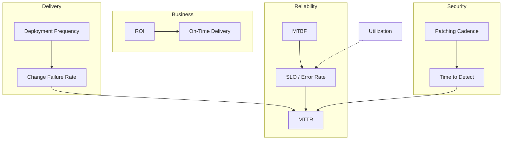

# Stop Optimizing Your Ticket Count: The Metrics That Change When You Go From Junior to Senior

**Alternative titles you can use on Medium:**
- *First Thinking Ideas That Should Change as You Move From Junior to Senior*
- *Junior Engineers Ship Features. Senior Engineers Ship Trust.*
- *The Scoreboard Changes: SLAs, DORA, ROI, and the Mindset Shift Nobody Prints in the Onboarding Doc*

**Subtitle:** SLA, SLO, error budgets, DORA, ROI, and security cadence — not as buzzwords, but as a new way of deciding what “good work” means.

> **Medium tip:** Paste section headings as **H2** blocks. Medium does not reliably support Markdown anchor links in a table of contents — use the **“At a glance”** list below as your scroll map.

---

> **Medium paste version:** Empty slots for tables. Screenshot from full `.md` file.

## At a glance — what this article gives you

- A clear **junior vs senior mindset shift**: from “did my code work?” to “did the *system* stay trustworthy?”
- Plain definitions of **SLA, SLO, error rates, MTTR, MTBF** — and when each one actually matters
- **DORA metrics** (deployment frequency, change failure rate) without treating them like a leaderboard
- **Business metrics** (ROI, utilization, on-time delivery) — and why seniors stop worshipping utilization alone
- **Security metrics** (time to detect, patching cadence) — risk as a clock, not a checkbox
- A **one-page mental model** you can reuse in 1:1s, incident reviews, and planning meetings

**One line to remember:** Juniors optimize **tasks**. Seniors optimize **systems, outcomes, and risk over time**.

> **New to the jargon?** Skip to **[Terms defined — the dictionary](#terms-defined--the-dictionary-read-this-first)** before the deep sections. Every acronym and fuzzy phrase used in this series gets a plain-English line there.

---

## Terms defined — the dictionary (read this first)

Read this section once if you are **not** an SRE, or if meetings feel like acronym bingo. Each term gets **what it means** and **why you should care**.

### Work and delivery (everyday engineering)

> **📷 Insert table screenshot here (Table 1)**  
> *Work and delivery (everyday engineering)*

<!-- Empty slot -->

### Reliability promises (SLA family)

> **📷 Insert table screenshot here (Table 2)**  
> *Reliability promises (SLA family)*

<!-- Empty slot -->

### Recovery and stability over time

> **📷 Insert table screenshot here (Table 3)**  
> *Recovery and stability over time*

<!-- Empty slot -->

### Software delivery (DORA)

> **📷 Insert table screenshot here (Table 4)**  
> *Software delivery (DORA)*

<!-- Empty slot -->

### Business and planning

> **📷 Insert table screenshot here (Table 5)**  
> *Business and planning*

<!-- Empty slot -->

### Security and risk

> **📷 Insert table screenshot here (Table 6)**  
> *Security and risk*

<!-- Empty slot -->

**How to use this dictionary:** When a section introduces a term, it will often say **“Defined above”** or give a one-line reminder. You do not need to memorize — **recognize** the word and know where to look.

---

## Table of contents

1. [Terms defined — the dictionary](#terms-defined--the-dictionary-read-this-first)
2. [The promotion nobody announces: your scoreboard changes](#the-promotion-nobody-announces-your-scoreboard-changes)
2. [The promotion nobody announces: your scoreboard changes](#the-promotion-nobody-announces-your-scoreboard-changes)
3. [Junior thinking vs senior thinking — the big picture](#junior-thinking-vs-senior-thinking--the-big-picture)
4. [System stability & reliability — when “it works on my machine” stops being enough](#system-stability--reliability--when-it-works-on-my-machine-stops-being-enough)
5. [SLA vs SLO — promise vs target](#sla-vs-slo--promise-vs-target)
6. [Error rates — the signal, not the shame number](#error-rates--the-signal-not-the-shame-number)
7. [MTTR — how fast you recover when reality wins](#mttr--how-fast-you-recover-when-reality-wins)
8. [MTBF — how long calm lasts between storms](#mtbf--how-long-calm-lasts-between-storms)
9. [Software delivery & performance — DORA without the vanity leaderboard](#software-delivery--performance--dora-without-the-vanity-leaderboard)
10. [Deployment frequency — speed with guardrails](#deployment-frequency--speed-with-guardrails)
11. [Change failure rate — the price of moving fast](#change-failure-rate--the-price-of-moving-fast)
12. [Business value & efficiency — the conversation that enters the room](#business-value--efficiency--the-conversation-that-enters-the-room)
13. [ROI — did the thing earn its keep?](#roi--did-the-thing-earn-its-keep)
14. [Resource utilization — full is not always healthy](#resource-utilization--full-is-not-always-healthy)
15. [On-time delivery rate — deadlines vs commitments](#on-time-delivery-rate--deadlines-vs-commitments)
16. [Security & risk — clocks that never pause](#security--risk--clocks-that-never-pause)
17. [Time to detect — the silent gap that hurts](#time-to-detect--the-silent-gap-that-hurts)
18. [Patching cadence — hygiene as a habit, not a hero sprint](#patching-cadence--hygiene-as-a-habit-not-a-hero-sprint)
19. [How the metrics fit together — one senior dashboard in your head](#how-the-metrics-fit-together--one-senior-dashboard-in-your-head)
20. [Conclusion — what to optimize next quarter](#conclusion--what-to-optimize-next-quarter)

---

## The promotion nobody announces: your scoreboard changes

Early in your career, feedback is simple:

- Did the feature ship?
- Did the tests pass?
- Did the reviewer approve the PR?

Those are **necessary**. They are not **sufficient** — and nobody sends a calendar invite when the scoreboard quietly changes.

Somewhere between “junior” and “senior,” you are expected to care about different questions:

- Did we **break trust** with users or other teams?
- Did we **recover quickly** when something went wrong?
- Did we **move safely**, not just move often?
- Did this work **pay for itself** — in money, time, or risk removed?
- Did we **leave the system more secure** than we found it?

This article is a map of that shift — through the metrics that start showing up in dashboards, incident reviews, and leadership slides. Not so you can memorize acronyms, but so you can **think like the job is bigger than your branch**.

**Real-life analogy:** A junior cook is judged on **plating one dish**. A head chef is judged on **whether the kitchen stays open all night** — food quality, speed, wasted ingredients, and whether someone gets hospitalized from bad oysters.

---

## Junior thinking vs senior thinking — the big picture

> **📷 Insert table screenshot here (Table 7)**  
> *Junior thinking vs senior thinking — the big picture*

<!-- Empty slot -->

None of this means juniors are “wrong.” It means **the job’s definition of good expands**. The metrics below are how organizations make that expansion visible.

---

## System stability & reliability — when “it works on my machine” stops being enough

**Junior frame:** “I merged it; QA passed; we’re good.”

**Senior frame:** “What happens at 2× traffic, during a deploy, when a dependency hiccups, or when someone runs yesterday’s job twice?”

Reliability metrics are not about fear. They are about **honest promises** — to users, to sales, to finance, and to the on-call engineer who inherits your design at 3 a.m.

**Bridge:** Before SLAs and SLOs, remember — **stability is a feature** with compound interest. Every silent failure you ignore becomes someone else’s emergency later.

---

## SLA vs SLO — promise vs target

These two get swapped in meetings like `user_id` and `User Id`. They are related — but not the same thing.

### SLA — Service Level Agreement

**Defined:** A **contractual promise** to a customer (or internal customer) about how reliable or fast a service will be — with consequences if you miss.

An **SLA** usually includes:

- what you measure (availability, latency, support response),
- the threshold (e.g. 99.9% uptime per month),
- and **consequences** if you miss (credits, penalties, escalations).

**Real-life analogy:** A pizza shop promises **“30 minutes or it’s free.”** That is an SLA — customer-facing, with teeth.

### SLO — Service Level Objective

**Defined:** An **internal target** your team sets — stricter than the SLA — so you have buffer before customers feel pain.

An **SLO** should be **stricter** than the SLA — a buffer zone.

**Example:**

- **SLO:** 99.95% availability (what engineering tries to hit)
- **SLA:** 99.9% availability (what legal puts in the contract)

**Real-life analogy:** You tell your friend you’ll arrive by **6:00** (SLO) so you can still be on time for the **6:30** movie (SLA).

### Junior → senior shift

> **📷 Insert table screenshot here (Table 8)**  
> *Junior → senior shift*

<!-- Empty slot -->

### Error budgets (the idea that connects SLA/SLO to daily work)

**Defined:** The small amount of **allowed failure** (downtime, errors, slow requests) you can “spend” each month while still meeting your SLO — like a monthly allowance for things going wrong.

If your SLO is 99.9% monthly, you have a small **error budget** — allowed unreliability before you breach the objective. Seniors ask:

- “Should we spend budget on **this risky launch**, or save it for holiday traffic?”
- “Are we burning budget on **known debt**?”

**Pitfall:** Publishing an SLA without an SLO is like signing a lease without checking your bank balance.

---

## Error rates — the signal, not the shame number

**Error rate** = how often requests, jobs, or transactions fail — usually as a **percentage** over a window.

Examples:

- HTTP **5xx rate** = 0.2% of requests
- Pipeline **failure rate** = 3 failed runs per 1,000
- Data job **null-rate spikes** treated as quality errors

### Junior → senior shift

> **📷 Insert table screenshot here (Table 9)**  
> *Junior → senior shift*

<!-- Empty slot -->

**Real-life analogy:** A hospital tracks **complication rates** — not to shame surgeons, but to find **systemic** issues (scheduling, handoffs, equipment). A single bad day matters less than a **pattern**.

### Practical habits seniors build

- Split **client errors (4xx)** vs **server errors (5xx)** — different owners, different fixes.
- Track **error budget burn rate** after deploys.
- Ask **“errors per what?”** — per request, per dollar, per customer segment?

**Pitfall:** Chasing **zero** error rate often creates **hidden risk** — fear of deploying, manual hacks, or silent data drops that do not increment your counter.

---

## MTTR — how fast you recover when reality wins

**MTTR (Mean Time to Resolution / Recovery)** = average time from **problem detected** → **service restored** (definitions vary — align yours in the team glossary).

Note: DORA also uses **MTTR** for *failed changes* — how fast you restore after a bad deploy. Same spirit: **recovery speed**.

### Junior → senior shift

> **📷 Insert table screenshot here (Table 10)**  
> *Junior → senior shift*

<!-- Empty slot -->

**Real-life analogy:** Fire drills are not about pretending fires never happen. They are about **everyone knowing where the extinguishers are**.

### What actually lowers MTTR

- **Runbooks** that match real failures (not fantasy docs)
- **Feature flags** and **canaries**
- **Observability** — logs, traces, metrics with **deployment markers**
- **Clear incident roles** — commander, comms, scribe
- **Blameless postmortems** that produce **one concrete follow-up**

**Pitfall:** Teams celebrate “zero incidents” while **MTTR is secretly terrible** — the first real outage becomes a multi-hour legend for the wrong reasons.

---

## MTBF — how long calm lasts between storms

**MTBF (Mean Time Between Failures)** = average time a system runs **without a failure** (for repairable systems).

High MTBF → failures are **rare**.  
Low MTBF → you are living in **chronic pain** — even if each fix is fast.

### Junior → senior shift

> **📷 Insert table screenshot here (Table 11)**  
> *Junior → senior shift*

<!-- Empty slot -->

**Real-life analogy:** Your car **starts** every morning (good MTTR when it rarely breaks) vs it **breaks down every month** (bad MTBF — you live at the mechanic).

### MTTR vs MTBF — use both

> **📷 Insert table screenshot here (Table 12)**  
> *MTTR vs MTBF — use both*

<!-- Empty slot -->

**Senior move:** Stop optimizing only firefighting (MTTR) while ignoring **why the fire started again** (MTBF).

---

## Software delivery & performance — DORA without the vanity leaderboard

**DORA metrics** (DevOps Research and Assessment) describe **how teams deliver software** — popularized by the *Accelerate* research. Four core metrics:

1. **Deployment frequency** — how often you deploy to production
2. **Lead time for changes** — commit → production
3. **Change failure rate** — % of changes causing failure
4. **MTTR** — recovery time after failure

This article focuses on the two you asked for — **deployment frequency** and **change failure rate** — but seniors know they are **pairs**, not trophies.

**Real-life analogy:** DORA is not “who’s fastest.” It is “can you **jog reliably** without tripping every third step?”

---

## Deployment frequency — speed with guardrails

**Deployment frequency** = how often you successfully release to production (hourly, daily, weekly…).

### Junior → senior shift

> **📷 Insert table screenshot here (Table 13)**  
> *Junior → senior shift*

<!-- Empty slot -->

**Why seniors like higher frequency (when done right):**

- Smaller diffs → easier reviews and debugging
- Faster feedback from real users
- Less “release day trauma”

**Real-life analogy:** Delivering **one hot meal every hour** with a tested kitchen beats **one giant banquet once a month** where anything might be undercooked.

### When high frequency is a lie

- Deploys that are **config-only theater** (not real change)
- “Deploy” meaning **restart** without validation
- Frequency up, **CFR** also up — that is not maturity, that is ** roulette**

**Senior question:** “What **percentage** of deploys are low-risk vs high-risk changes — and do we treat them differently?”

---

## Change failure rate — the price of moving fast

**CFR (Change Failure Rate)** = percentage of production changes that cause **degraded service** or require **hotfix / rollback**.

Rough form:

$$
\text{CFR} = \frac{\text{failed changes}}{\text{total changes}} \times 100\%
$$

*In plain English:* of everything we shipped, how much **broke prod**?

### Junior → senior shift

> **📷 Insert table screenshot here (Table 14)**  
> *Junior → senior shift*

<!-- Empty slot -->

**Real-life analogy:** If **one in five** flights you pilot ends in an emergency landing, the answer is not “fly less forever” — it is **training, checklists, and better instruments**.

### Healthy tension: frequency ↑ vs CFR ↑

> **📷 Insert table screenshot here (Table 15)**  
> *Healthy tension: frequency ↑ vs CFR ↑*

<!-- Empty slot -->

**Pitfall:** Gaming CFR by defining “failure” too narrowly (ignore customer-impacting bugs that did not trigger rollback).

---

## Business value & efficiency — the conversation that enters the room

At some point, someone asks: **“Was this worth it?”**

Not morally — **economically**. Seniors translate engineering work into language finance and product already speak.

This is not selling out. It is **prioritization with lights on**.

---

## ROI — did the thing earn its keep?

**ROI (Return on Investment)** = financial gain relative to cost.

Simple form:

$$
\text{ROI} = \frac{\text{Benefit} - \text{Cost}}{\text{Cost}} \times 100\%
$$

*In plain English:* for every dollar spent, how many dollars came back (or how much cost was removed)?

### Examples in IT

> **📷 Insert table screenshot here (Table 16)**  
> *Examples in IT*

<!-- Empty slot -->

### Junior → senior shift

> **📷 Insert table screenshot here (Table 17)**  
> *Junior → senior shift*

<!-- Empty slot -->

**Real-life analogy:** Renovating a kitchen increases home value **only if** you plan to sell or use it for years — not every upgrade pays back.

**Pitfall:** ROI spreadsheets that ignore **maintenance cost**, **on-call burden**, and **security exposure**.

---

## Resource utilization — full is not always healthy

**Resource utilization** = how much of available capacity is used — CPU, memory, disk, **or human hours**.

### Junior → senior shift

> **📷 Insert table screenshot here (Table 18)**  
> *Junior → senior shift*

<!-- Empty slot -->

**Real-life analogy:** A highway at **100% capacity** is not efficient — it is a **traffic jam**. Engineers want **headroom**, like lanes and on-ramps.

### Utilization sweet spot (mental model)

- **Too low** — wasted money (but maybe fine for burst workloads)
- **Too high** — fragile under load; **everything becomes urgent**
- **Senior goal** — predictable performance with **autoscaling** or **queueing** strategies, not bragging about redlines

**Data/engineering angle:** Batch pipelines at 100% cluster utilization sound great until **one late partition** delays everything downstream.

---

## On-time delivery rate — deadlines vs commitments

**On-time delivery rate** = percentage of milestones, sprint commitments, or project phases completed by the **original** deadline.

### Junior → senior shift

> **📷 Insert table screenshot here (Table 19)**  
> *Junior → senior shift*

<!-- Empty slot -->

**Real-life analogy:** A restaurant that promises **every dish in 5 minutes** will either miss deadlines or serve raw chicken. **Honest promises** beat perfect plans.

### What seniors protect

- **Definition of done** includes ops, docs, monitoring — not just merged code
- **Buffer** for unknowns — especially integrations and compliance
- **Leading indicators** — blocked tickets, scope creep, test flakiness — not only the final date

**Pitfall:** Gaming on-time rate by **moving deadlines** silently or shrinking scope without telling stakeholders.

---

## Security & risk — clocks that never pause

Security is not a phase at the end. It is **exposure over time**:

- how long vulnerabilities exist,
- how long until you notice abuse,
- how fast you patch when the world moves.

Seniors think in **timers**, not checkboxes.

---

## Time to detect — the silent gap that hurts

**TTD (Time to Detect)** = duration from when a **breach, vulnerability exploit, or serious misconfiguration** occurs → when the team **knows**.

TTD is often worse than time to fix — because until you detect, **nothing else starts**.

### Junior → senior shift

> **📷 Insert table screenshot here (Table 20)**  
> *Junior → senior shift*

<!-- Empty slot -->

**Real-life analogy:** A water leak behind the wall — the damage isn’t the pipe breaking; it’s the **weeks until you see the stain**.

### What shrinks TTD

- Centralized logs with **retention** that matches attacker dwell time
- **Anomaly detection** on auth and data access
- **Canary credentials** and honeypots (where appropriate)
- Regular **tabletop exercises** — “what would we see if…?”

**Pair TTD with MTTR:** Detect fast **and** recover fast — both show up in incident timelines and customer trust.

---

## Patching cadence — hygiene as a habit, not a hero sprint

**Patching cadence** = how regularly the team applies **security patches** — OS, dependencies, libraries, infrastructure images.

Measure it as:

- **average time** from critical CVE publish → patch in production,
- or **% systems** within policy compliance at any moment.

### Junior → senior shift

> **📷 Insert table screenshot here (Table 21)**  
> *Junior → senior shift*

<!-- Empty slot -->

**Real-life analogy:** Dental cleaning every six months beats **one emergency root canal** after years of skipping flossing.

### Practical senior moves

- **Golden images** rebuilt regularly
- **Dependency pinning** with automated update PRs
- **Policy tiers:** critical (48h), high (1 week), medium (scheduled)
- **Exception process** with expiry dates — no permanent waivers

**Pitfall:** Measuring “patches applied” without measuring **exposure window** — 100 patches late is not hygiene.

---

## How the metrics fit together — one senior dashboard in your head

You do not need seventeen dashboards. You need **one story**:

**Read it like a senior:**

1. **Ship often** (deployment frequency) but watch **CFR** — speed without safety is debt.
2. **SLOs / error rates** tell you if users feel pain.
3. **MTTR** is your apology speed; **MTBF** is whether you keep apologizing for the same thing.
4. **ROI** and **on-time delivery** anchor engineering to outcomes — not just activity.
5. **Utilization** explains fragility — too tight, and SLOs crack under load.
6. **TTD** and **patching cadence** are security’s MTTR/MTBF — exposure time kills.

**Real-life analogy:** Running a restaurant — ticket count (junior) vs **repeat customers, health inspections, food waste, staff burnout, and profit** (senior).

---

## Conclusion — what to optimize next quarter

If you are growing toward senior impact, pick **one metric per area** and make it honest:

> **📷 Insert table screenshot here (Table 22)**  
> *Conclusion — what to optimize next quarter*

<!-- Empty slot -->

The mindset shift is not cynicism. It is **ownership at a longer time horizon**.

Junior you proved you could **build**. Senior you proves the organization can **trust what you built** — through metrics that reflect reality, not comfort.

**Feedback welcome:** if you want a follow-up on **error budgets in practice**, **DORA metrics for data teams**, or **how to present these in performance reviews**, say which scenario matches your world — on-call, data pipelines, or product engineering.
