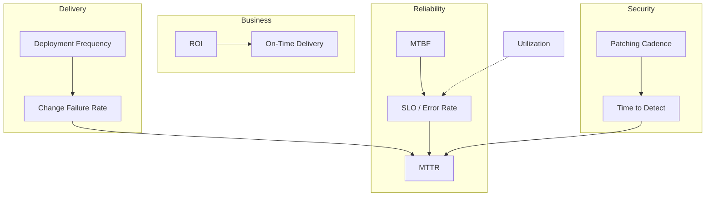

# Stop Optimizing Your Ticket Count: The Metrics That Change When You Go From Junior to Senior

**Alternative titles you can use on Medium:**
- *First Thinking Ideas That Should Change as You Move From Junior to Senior*
- *Junior Engineers Ship Features. Senior Engineers Ship Trust.*
- *The Scoreboard Changes: SLAs, DORA, ROI, and the Mindset Shift Nobody Prints in the Onboarding Doc*

**Subtitle:** SLA, SLO, error budgets, DORA, ROI, and security cadence — not as buzzwords, but as a new way of deciding what “good work” means.

> **Medium tip:** Paste section headings as **H2** blocks. Medium does not reliably support Markdown anchor links in a table of contents — use the **“At a glance”** list below as your scroll map.

---

## At a glance — what this article gives you

- A clear **junior vs senior mindset shift**: from “did my code work?” to “did the *system* stay trustworthy?”
- Plain definitions of **SLA, SLO, error rates, MTTR, MTBF** — and when each one actually matters
- **DORA metrics** (deployment frequency, change failure rate) without treating them like a leaderboard
- **Business metrics** (ROI, utilization, on-time delivery) — and why seniors stop worshipping utilization alone
- **Security metrics** (time to detect, patching cadence) — risk as a clock, not a checkbox
- A **one-page mental model** you can reuse in 1:1s, incident reviews, and planning meetings

**One line to remember:** Juniors optimize **tasks**. Seniors optimize **systems, outcomes, and risk over time**.

> **New to the jargon?** Skip to **[Terms defined — the dictionary](#terms-defined--the-dictionary-read-this-first)** before the deep sections.

> **How this article reads:** Sections marked **📋 Work story** are short, real-office scenes — Slack messages, deploys, finance asking questions — explained like you'd tell a colleague at lunch.

---

## Terms defined — the dictionary (read this first)

Read this section once if you are **not** an SRE, or if meetings feel like acronym bingo. Each term gets **what it means** and **why you should care**.

### Work and delivery (everyday engineering)

| Term | Plain English | Why it matters |
|------|---------------|----------------|
| **Task / ticket** | A single piece of work (Jira, Linear, etc.) | Juniors are graded here; seniors are graded on **outcomes beyond one ticket**. |
| **PR (pull request)** | Proposed code change others review before merge | “Shipped” often means **merged**, not **safe in production**. |
| **Deploy** | Putting new code or config into **production** — the live environment customers use | Where failures become **real** and **measurable**. |
| **Production (prod)** | The live system paying users depend on | Not staging, not your laptop. |
| **Rollback** | Reverting to the last known-good version | Seniors treat this as a **feature**, not embarrassment. |
| **Canary / holdout** | Release to a **small slice** of traffic first | Reduces **blast radius** if something breaks. |
| **On-call** | Engineer responsible for incidents **right now** | Who gets paged when your metric turns red at 3 a.m. |
| **Incident** | Unplanned problem hurting users or SLOs | Starts a clock: detect → fix → learn. |
| **Dashboard** | Screen of charts (Grafana, Datadog, etc.) | Only useful if metrics tie to **decisions**. |
| **Blast radius** | How much damage one failure can cause | Small deploys shrink it. |

### Reliability promises (SLA family)

| Term | Plain English | Why it matters |
|------|---------------|----------------|
| **SLI (Service Level Indicator)** | A **number you can measure** — e.g. “% of requests faster than 200 ms” | The **thermometer**. |
| **SLO (Service Level Objective)** | An **internal target** for that number — e.g. “99.9% of requests meet the SLI monthly” | The **goal** engineering owns. |
| **SLA (Service Level Agreement)** | A **customer-facing promise** in a contract, often with penalties | The **public promise** — usually looser than your SLO. |
| **Availability / uptime** | % of time a service works as expected | “99.9%” sounds small until you calculate **minutes down per month**. |
| **Latency** | **Delay** — how long a request or job takes | Users feel **tails** (slow requests), not averages. |
| **p95 / p99 (percentile)** | “95% (or 99%) of requests were **at least this fast**” | Captures **worst-case-ish** experience better than the mean. |
| **Error rate** | % of requests or jobs that **fail** | Signal, not shame — if defined honestly. |
| **5xx / 4xx (HTTP codes)** | **5xx** = server broke; **4xx** = client/request issue (often different owner) | Split them or you chase the wrong team. |
| **Error budget** | Allowed amount of **unreliability** before you miss your SLO | Lets you **trade** risk for speed **on purpose**. |

### Recovery and stability over time

| Term | Plain English | Why it matters |
|------|---------------|----------------|
| **MTTR (Mean Time to Recovery / Resolution)** | Average time from **“we know it’s broken”** to **“users are OK again”** | Measures **firefighting speed**. |
| **MTBF (Mean Time Between Failures)** | Average time **between** failures | Measures **how often** pain repeats. |
| **Postmortem** | Blameless write-up after an incident: what happened, what we fix | Turns drama into **process**. |

### Software delivery (DORA)

| Term | Plain English | Why it matters |
|------|---------------|----------------|
| **DORA** | Research group whose metrics describe **how well teams ship software** | Not a vanity contest — a **balance** of speed and safety. |
| **Deployment frequency** | How **often** you successfully release to production | Smaller, frequent releases often reduce risk. |
| **Lead time for changes** | Time from **code committed** to **running in prod** | Long lead time = big batches = scarier releases. |
| **CFR (Change Failure Rate)** | % of releases that **cause failure** (rollback, hotfix, outage) | The **price** of moving fast without guardrails. |

### Business and planning

| Term | Plain English | Why it matters |
|------|---------------|----------------|
| **ROI (Return on Investment)** | **(Gain − cost) ÷ cost** — did the project pay off? | Seniors speak **money and time**, not only “cool tech.” |
| **Resource utilization** | % of **CPU, memory, or people** actually in use | 100% sounds efficient; often means **no room for spikes**. |
| **On-time delivery rate** | % of milestones hit by the **original** deadline | Gaming it with silent scope cuts destroys trust. |
| **Sprint / milestone** | Fixed time box or checkpoint in project planning | Useful for planning; dangerous as a **pure grade**. |

### Security and risk

| Term | Plain English | Why it matters |
|------|---------------|----------------|
| **TTD (Time to Detect)** | Time from **breach or vuln exists** to **team knows** | Invisible problems grow damage every hour. |
| **CVE** | Public catalog ID for a known **security vulnerability** | Triggers **patching** urgency. |
| **Patching cadence** | How **regularly** you apply security fixes | Hygiene, not hero sprints once a year. |
| **Vulnerability** | A weakness attackers could exploit | Exposure time is the enemy. |

**How to use this dictionary:** When a section introduces a term, it will often say **“Defined above”** or give a one-line reminder. You do not need to memorize — **recognize** the word and know where to look.

---

## Table of contents

1. [Terms defined — the dictionary](#terms-defined--the-dictionary-read-this-first)
2. [The promotion nobody announces: your scoreboard changes](#the-promotion-nobody-announces-your-scoreboard-changes)
3. [Junior thinking vs senior thinking — the big picture](#junior-thinking-vs-senior-thinking--the-big-picture)
4. [System stability & reliability — when “it works on my machine” stops being enough](#system-stability--reliability--when-it-works-on-my-machine-stops-being-enough)
5. [SLA vs SLO — promise vs target](#sla-vs-slo--promise-vs-target)
6. [Error rates — the signal, not the shame number](#error-rates--the-signal-not-the-shame-number)
7. [MTTR — how fast you recover when reality wins](#mttr--how-fast-you-recover-when-reality-wins)
8. [MTBF — how long calm lasts between storms](#mtbf--how-long-calm-lasts-between-storms)
9. [Software delivery & performance — DORA without the vanity leaderboard](#software-delivery--performance--dora-without-the-vanity-leaderboard)
10. [Deployment frequency — speed with guardrails](#deployment-frequency--speed-with-guardrails)
11. [Change failure rate — the price of moving fast](#change-failure-rate--the-price-of-moving-fast)
12. [Business value & efficiency — the conversation that enters the room](#business-value--efficiency--the-conversation-that-enters-the-room)
13. [ROI — did the thing earn its keep?](#roi--did-the-thing-earn-its-keep)
14. [Resource utilization — full is not always healthy](#resource-utilization--full-is-not-always-healthy)
15. [On-time delivery rate — deadlines vs commitments](#on-time-delivery-rate--deadlines-vs-commitments)
16. [Security & risk — clocks that never pause](#security--risk--clocks-that-never-pause)
17. [Time to detect — the silent gap that hurts](#time-to-detect--the-silent-gap-that-hurts)
18. [Patching cadence — hygiene as a habit, not a hero sprint](#patching-cadence--hygiene-as-a-habit-not-a-hero-sprint)
19. [How the metrics fit together — one senior dashboard in your head](#how-the-metrics-fit-together--one-senior-dashboard-in-your-head)
20. [Conclusion — what to optimize next quarter](#conclusion--what-to-optimize-next-quarter)

---

## The promotion nobody announces: your scoreboard changes

Early in your career, feedback is simple:

- Did the feature ship?
- Did the tests pass?
- Did the reviewer approve the PR?

Those are **necessary**. They are not **sufficient** — and nobody sends a calendar invite when the scoreboard quietly changes.

Somewhere between “junior” and “senior,” you are expected to care about different questions:

- Did we **break trust** with users or other teams?
- Did we **recover quickly** when something went wrong?
- Did we **move safely**, not just move often?
- Did this work **pay for itself** — in money, time, or risk removed?
- Did we **leave the system more secure** than we found it?

This article is a map of that shift — through the metrics that start showing up in dashboards, incident reviews, and leadership slides. Not so you can memorize acronyms, but so you can **think like the job is bigger than your branch**.

### 📋 Work story (simple)

**Monday, 9:04 a.m.** Your manager asks in Slack: “Did you ship the login fix?”  
You say **yes** — the PR merged Friday.  
At **2:30 p.m.**, support reports users still cannot log in on mobile. The fix is in `main`, but **not in production** yet. Nobody tracked **deploy**.

**Junior scorecard:** ticket closed ✅  
**Senior scorecard:** users still broken ❌

**Real-life analogy:** A junior cook is judged on **plating one dish**. A head chef is judged on **whether the kitchen stays open all night** — food quality, speed, wasted ingredients, and whether someone gets hospitalized from bad oysters.

**Another one from the office:** Finishing your slide deck is not the same as **delivering the presentation**. Shipping code is not the same as **customers being OK**.

---

## Junior thinking vs senior thinking — the big picture

| Topic | Junior instinct (common & understandable) | Senior instinct (what experience teaches) |
|-------|-------------------------------------------|-------------------------------------------|
| **Success** | “My task is done.” | “The system is still healthy for the next person and the next deploy.” |
| **Errors** | “Zero errors = perfect.” | “Some errors are inevitable — manage **rate**, **blast radius**, and **recovery**.” |
| **Speed** | “Ship faster = better engineer.” | “Ship **safely** at a sustainable cadence.” |
| **Utilization** | “Keep servers/people at 100% = efficient.” | “Headroom is not waste — it is **shock absorption**.” |
| **Deadlines** | “Hit the date at all costs.” | “Hit **meaningful** dates — or renegotiate early with data.” |
| **Security** | “Security team’s problem after launch.” | “Risk is a **timer** — detection and patching are part of delivery.” |

None of this means juniors are “wrong.” It means **the job’s definition of good expands**. The metrics below are how organizations make that expansion visible.

### 📋 Work story (simple)

| Situation at work | Junior reaction | Senior reaction |
|-------------------|-----------------|-----------------|
| Checkout is slow for **1%** of users | “Only 1%, ship the feature.” | “Who are they? Paying customers? What’s **p99** latency?” |
| Manager asks for a date | “We’ll make it.” | “Here’s **risk**, **scope**, and what we **won’t** do.” |
| Security sends a CVE email | “I’ll look next sprint.” | “What’s our **patching cadence** for critical?” |

**Real-life analogy:** Learning to drive: at first you celebrate **not stalling**. Later you care about **not killing the transmission**, **fuel cost**, and **whether passengers arrive alive**.

## System stability & reliability — when “it works on my machine” stops being enough

**Junior frame:** “I merged it; QA passed; we’re good.”

**Senior frame:** “What happens at 2× traffic, during a deploy, when a dependency hiccups, or when someone runs yesterday’s job twice?”

Reliability metrics are not about fear. They are about **honest promises** — to users, to sales, to finance, and to the on-call engineer who inherits your design at 3 a.m.

**Bridge:** Before SLAs and SLOs, remember — **stability is a feature** with compound interest. Every silent failure you ignore becomes someone else’s emergency later.

### 📋 Work story (simple)

Your API returns **200 OK** in tests. On launch day, the database connection pool is sized for **10 users**, and marketing sends **10,000**.

**“It works on my machine”** is true. **“It works for the business”** is false.

**Real-life analogy:** A door lock works when **you** try it once. Senior thinking asks: does it still work when **everyone leaves at 5 p.m. at once**?

---

## SLA vs SLO — promise vs target

These two get swapped in meetings like `user_id` and `User Id`. They are related — but not the same thing.

### SLA — Service Level Agreement

**Defined:** A **contractual promise** to a customer (or internal customer) about how reliable or fast a service will be — with consequences if you miss.

An **SLA** usually includes:

- what you measure (availability, latency, support response),
- the threshold (e.g. 99.9% uptime per month),
- and **consequences** if you miss (credits, penalties, escalations).

**Real-life analogy:** A pizza shop promises **“30 minutes or it’s free.”** That is an SLA — customer-facing, with teeth.

**Work example:** Your company sells B2B software. The contract says **“99.9% uptime or credit.”** Sales signed it. Engineering now lives inside that box — that is the **SLA**.

### SLO — Service Level Objective

**Defined:** An **internal target** your team sets — stricter than the SLA — so you have buffer before customers feel pain.

An **SLO** should be **stricter** than the SLA — a buffer zone.

**Example:**

- **SLO:** 99.95% availability (what engineering tries to hit)
- **SLA:** 99.9% availability (what legal puts in the contract)

**Real-life analogy:** You tell your friend you’ll arrive by **6:00** (SLO) so you can still be on time for the **6:30** movie (SLA).

**Work example:** Engineering targets **99.95%** internally. Legal promises customers **99.9%**. The **0.05% gap** is your safety buffer — not “slackers being picky.”

### Junior → senior shift

| Junior thinking | Senior thinking |
|-----------------|-----------------|
| “SLA is DevOps paperwork.” | “SLOs are how we **budget** reliability work before customers feel pain.” |
| “We need 100% uptime.” | “100% is a myth — we choose **what failure is acceptable** and **how fast we fix**.” |
| “Alerts fire = bad engineer.” | “Alerts are **feedback** — tune them to SLOs, not egos.” |

### Error budgets (the idea that connects SLA/SLO to daily work)

**Defined:** The small amount of **allowed failure** (downtime, errors, slow requests) you can “spend” each month while still meeting your SLO — like a monthly allowance for things going wrong.

If your SLO is 99.9% monthly, you have a small **error budget** — allowed unreliability before you breach the objective. Seniors ask:

- “Should we spend budget on **this risky launch**, or save it for holiday traffic?”
- “Are we burning budget on **known debt**?”

**Pitfall:** Publishing an SLA without an SLO is like signing a lease without checking your bank balance.

### 📋 Work story (simple) — error budget in one meeting

Product wants a **big risky launch** the week before Black Friday.  
**Junior:** “Sure, we can squeeze it in.”  
**Senior:** “Our **error budget** is already 30% burned from last week’s deploy. If this launch fails, we miss **SLA** during peak sales. I recommend **January** or a **canary** with rollback ready.”

Same skills. Different **risk vocabulary**.

---

**Error rate** = how often requests, jobs, or transactions fail — usually as a **percentage** over a window.

Examples:

- HTTP **5xx rate** = 0.2% of requests
- Pipeline **failure rate** = 3 failed runs per 1,000
- Data job **null-rate spikes** treated as quality errors

### Junior → senior shift

| Junior thinking | Senior thinking |
|-----------------|-----------------|
| “Any error is unacceptable.” | “**Which errors matter** to users vs internal noise?” |
| “Look at the average.” | “Look at **tails** — p95/p99 latency, spike windows, retry storms.” |
| “Green dashboard = sleep.” | “Is the metric **actionable** and tied to an SLO?” |

**Real-life analogy:** A hospital tracks **complication rates** — not to shame surgeons, but to find **systemic** issues (scheduling, handoffs, equipment). A single bad day matters less than a **pattern**.

### 📋 Work story (simple)

Your dashboard shows **0.1% error rate**. Sounds tiny.  
But that **0.1%** might be **only paying enterprise customers** hitting a broken checkout — because errors are grouped wrong.

**Senior question:** “Errors for **whom** and on **which** path?” — not “how do we hit zero?”

**Everyday analogy:** One wrong answer on a **100-question quiz** is 1%. One wrong ingredient in a **peanut allergy** kitchen is not “only 1%.”

- Split **client errors (4xx)** vs **server errors (5xx)** — different owners, different fixes.
- Track **error budget burn rate** after deploys.
- Ask **“errors per what?”** — per request, per dollar, per customer segment?

**Pitfall:** Chasing **zero** error rate often creates **hidden risk** — fear of deploying, manual hacks, or silent data drops that do not increment your counter.

---

## MTTR — how fast you recover when reality wins

**MTTR (Mean Time to Resolution / Recovery)** = average time from **problem detected** → **service restored** (definitions vary — align yours in the team glossary).

Note: DORA also uses **MTTR** for *failed changes* — how fast you restore after a bad deploy. Same spirit: **recovery speed**.

### Junior → senior shift

| Junior thinking | Senior thinking |
|-----------------|-----------------|
| “My job is to prevent incidents.” | “Incidents will happen — my job includes **short MTTR** and **clean learning**.” |
| “Rollback is embarrassing.” | “Rollback is a **feature** — use it early.” |
| “Fix it perfectly in prod under pressure.” | “**Mitigate first**, root-cause second.” |

**Real-life analogy:** Fire drills are not about pretending fires never happen. They are about **everyone knowing where the extinguishers are**.

### 📋 Work story (simple) — the 2 a.m. deploy

**2:14 a.m.** — pager fires. Bad deploy. Checkout broken.  
**Junior path:** debug in prod for 90 minutes, hero fix, tired postmortem.  
**Senior path:** **rollback in 4 minutes**, checkout works, debug calmly at 10 a.m.

**MTTR:** 4 minutes vs 90 minutes. Same bug. Different **playbook**.

**Office analogy:** When the presentation crashes, you do not rebuild PowerPoint live on stage — you switch to the **backup PDF** (rollback), then fix the deck tomorrow.

- **Runbooks** that match real failures (not fantasy docs)
- **Feature flags** and **canaries**
- **Observability** — logs, traces, metrics with **deployment markers**
- **Clear incident roles** — commander, comms, scribe
- **Blameless postmortems** that produce **one concrete follow-up**

**Pitfall:** Teams celebrate “zero incidents” while **MTTR is secretly terrible** — the first real outage becomes a multi-hour legend for the wrong reasons.

---

## MTBF — how long calm lasts between storms

**MTBF (Mean Time Between Failures)** = average time a system runs **without a failure** (for repairable systems).

High MTBF → failures are **rare**.  
Low MTBF → you are living in **chronic pain** — even if each fix is fast.

### Junior → senior shift

| Junior thinking | Senior thinking |
|-----------------|-----------------|
| “We fixed it — closed ticket.” | “Why does it **keep** breaking? MTBF tells the story.” |
| “Add another retry.” | “Retries that **mask** flakiness destroy MTBF metrics and trust.” |
| “Hardware/vendor issue.” | “What **design choice** makes us fragile to that vendor?” |

**Real-life analogy:** Your car **starts** every morning (good MTTR when it rarely breaks) vs it **breaks down every month** (bad MTBF — you live at the mechanic).

### 📋 Work story (simple)

Every **Monday**, the same report job fails because the vendor file arrives in a **new format**. You fix it by hand. **MTTR** looks great — you are fast!  
**MTBF** looks terrible — the same fire **every week**.

**Senior fix:** automate detection + contract with vendor — not another heroic Monday.

---

| Metric | Question it answers |
|--------|---------------------|
| **MTTR** | When it breaks, how fast are we back? |
| **MTBF** | How often does it break at all? |

**Senior move:** Stop optimizing only firefighting (MTTR) while ignoring **why the fire started again** (MTBF).

---

## Software delivery & performance — DORA without the vanity leaderboard

**DORA metrics** (DevOps Research and Assessment) describe **how teams deliver software** — popularized by the *Accelerate* research. Four core metrics:

1. **Deployment frequency** — how often you deploy to production
2. **Lead time for changes** — commit → production
3. **Change failure rate** — % of changes causing failure
4. **MTTR** — recovery time after failure

This article focuses on the two you asked for — **deployment frequency** and **change failure rate** — but seniors know they are **pairs**, not trophies.

**Real-life analogy:** DORA is not “who’s fastest.” It is “can you **jog reliably** without tripping every third step?”

### 📋 Work story (simple)

**Team A:** deploys once a month. Release day is **stressful**, **12-hour** war room, everyone afraid.  
**Team B:** deploys **daily**, small changes, rollback is boring and routine.

When Team B breaks prod, they fix it in **minutes**. When Team A breaks prod, it is a **company-wide event**.

DORA is not about bragging — it is about **how scary Tuesday feels**.

---

**Deployment frequency** = how often you successfully release to production (hourly, daily, weekly…).

### Junior → senior shift

| Junior thinking | Senior thinking |
|-----------------|-----------------|
| “More deploys = we’re elite.” | “More **small, safe** deploys reduce batch size and risk.” |
| “We deploy Friday evening.” | “We deploy when **rollback** and **coverage** exist.” |
| “Manual deploy checklist is fine.” | “Repeatable pipelines **are** the product.” |

**Why seniors like higher frequency (when done right):**

- Smaller diffs → easier reviews and debugging
- Faster feedback from real users
- Less “release day trauma”

**Real-life analogy:** Delivering **one hot meal every hour** with a tested kitchen beats **one giant banquet once a month** where anything might be undercooked.

### When high frequency is a lie

- Deploys that are **config-only theater** (not real change)
- “Deploy” meaning **restart** without validation
- Frequency up, **CFR** also up — that is not maturity, that is ** roulette**

**Senior question:** “What **percentage** of deploys are low-risk vs high-risk changes — and do we treat them differently?”

### 📋 Work story (simple)

You change **one button color** and **one database migration** in the same deploy.  
The button ships fine. The migration **locks the table** for an hour.

**Senior habit:** split changes — **small deploys** so when something breaks, you know **which change** did it.

**Everyday analogy:** Do not pack **glass vases** and **rocks** in the same box.

---

**CFR (Change Failure Rate)** = percentage of production changes that cause **degraded service** or require **hotfix / rollback**.

Rough form:

$$
\text{CFR} = \frac{\text{failed changes}}{\text{total changes}} \times 100\%
$$

*In plain English:* of everything we shipped, how much **broke prod**?

### Junior → senior shift

| Junior thinking | Senior thinking |
|-----------------|-----------------|
| “Failed deploy = someone screwed up.” | “CFR is a **system signal** — tests, review, architecture, pressure.” |
| “Lower CFR by deploying less.” | “Lower CFR by **smaller changes**, better observability, safer paths.” |
| “Hide failures.” | “Track failures **honestly** or you cannot improve.” |

**Real-life analogy:** If **one in five** flights you pilot ends in an emergency landing, the answer is not “fly less forever” — it is **training, checklists, and better instruments**.

### Healthy tension: frequency ↑ vs CFR ↑

| Pattern | Interpretation |
|---------|----------------|
| Frequency ↑, CFR stable or ↓ | Real improvement |
| Frequency ↑, CFR ↑ | Moving too fast for current maturity |
| Frequency ↓, CFR ↑ | Bigger batches, scarier releases |
| Frequency ↓, CFR ↓ | Safer but **slow feedback** — watch lead time |

**Pitfall:** Gaming CFR by defining “failure” too narrowly (ignore customer-impacting bugs that did not trigger rollback).

### 📋 Work story (simple)

Last month: **20 deploys**, **4** caused incidents (rollback or hotfix).  
**CFR = 4/20 = 20%.** That is not shame — that is a **signal** to improve tests or shrink batches.

Hiding the 4 failures does not help. **Your manager cannot fund fixes** for problems that “do not exist.”

---

At some point, someone asks: **“Was this worth it?”**

Not morally — **economically**. Seniors translate engineering work into language finance and product already speak.

This is not selling out. It is **prioritization with lights on**.

### 📋 Work story (simple)

Leadership asks: “Should we build **Tool X** or **Tool Y**?”  
**Junior answer:** “Tool X uses Kubernetes and Rust — it’s modern.”  
**Senior answer:** “Tool Y saves **20 analyst hours/week** and costs **half** as much to run. Rough **ROI** in one slide.”

Guess which answer gets budget.

---

**ROI (Return on Investment)** = financial gain relative to cost.

Simple form:

$$
\text{ROI} = \frac{\text{Benefit} - \text{Cost}}{\text{Cost}} \times 100\%
$$

*In plain English:* for every dollar spent, how many dollars came back (or how much cost was removed)?

### Examples in IT

| Initiative | Cost | Benefit | ROI story |
|------------|------|---------|-----------|
| Self-serve reporting tool | 3 eng-months | −40 analyst hours/week | Time saved → money saved |
| Cache layer | Infra + dev | −30% DB cost, faster pages | Revenue + infra savings |
| “Cool” microservice split | Large | Unclear latency win | **Negative ROI** risk |

### Junior → senior shift

| Junior thinking | Senior thinking |
|-----------------|-----------------|
| “Cool tech is enough.” | “**Outcome** first — tech is a lever.” |
| “ROI is finance’s job.” | “I bring **rough numbers** so decisions aren’t pure vibes.” |
| “Estimate ROI after we build.” | “Kill bad bets **early** with cheap experiments.” |

**Real-life analogy:** Renovating a kitchen increases home value **only if** you plan to sell or use it for years — not every upgrade pays back.

**Pitfall:** ROI spreadsheets that ignore **maintenance cost**, **on-call burden**, and **security exposure**.

### 📋 Work story (simple)

You build a **shiny internal tool** in 3 months. It saves **2 hours/week** for **3 people**.  
**Benefit:** ~6 hours/week. **Cost:** 3 engineer-months + hosting + on-call when it breaks.

**Senior pause:** Was that worth it — or should we have bought an off-the-shelf tool?

**Everyday analogy:** Buying a **bread machine** only pays off if you bake **often** — not once a month.

---

**Resource utilization** = how much of available capacity is used — CPU, memory, disk, **or human hours**.

### Junior → senior shift

| Junior thinking | Senior thinking |
|-----------------|-----------------|
| “90% CPU = efficient.” | “90% CPU = **no room** for spikes — latency waits in line.” |
| “Keep the team at 100% allocated.” | **Slack** enables learning, incidents, and unplanned critical work.” |
| “Scale up when full.” | “Ask **why** we’re full — cache, batch windows, bad queries?” |

**Real-life analogy:** A highway at **100% capacity** is not efficient — it is a **traffic jam**. Engineers want **headroom**, like lanes and on-ramps.

### Utilization sweet spot (mental model)

- **Too low** — wasted money (but maybe fine for burst workloads)
- **Too high** — fragile under load; **everything becomes urgent**
- **Senior goal** — predictable performance with **autoscaling** or **queueing** strategies, not bragging about redlines

**Data/engineering angle:** Batch pipelines at 100% cluster utilization sound great until **one late partition** delays everything downstream.

### 📋 Work story (simple)

Your team is **100% allocated** on the roadmap.  
A **security CVE** lands. A **production incident** lands. Same week.

Nobody has slack — so **both** slip. That is not bad luck. That is **utilization without headroom**.

**Office analogy:** If every meeting slot is booked, there is **no time for the fire drill** — until the fire is real.

---

**On-time delivery rate** = percentage of milestones, sprint commitments, or project phases completed by the **original** deadline.

### Junior → senior shift

| Junior thinking | Senior thinking |
|-----------------|-----------------|
| “Missed sprint = team failed.” | “Missed sprint = **forecast** or **scope** problem — fix the system.” |
| “Say yes to hit the date.” | “Renegotiate **early** with trade-offs visible.” |
| “Velocity is pride.” | **Predictability** beats heroics. |

**Real-life analogy:** A restaurant that promises **every dish in 5 minutes** will either miss deadlines or serve raw chicken. **Honest promises** beat perfect plans.

### What seniors protect

- **Definition of done** includes ops, docs, monitoring — not just merged code
- **Buffer** for unknowns — especially integrations and compliance
- **Leading indicators** — blocked tickets, scope creep, test flakiness — not only the final date

**Pitfall:** Gaming on-time rate by **moving deadlines** silently or shrinking scope without telling stakeholders.

### 📋 Work story (simple)

Sprint goal: “Ship checkout v2.”  
Friday: team **drops** tax calculation and **moves** the deadline quietly.  
**On-time rate:** 100%. **Trust:** down.

**Senior move:** “We will ship **payments** on time; **tax** moves to next sprint” — said **Monday**, not Friday.

**Everyday analogy:** Promising guests **dinner at 7** but serving **only dessert** on time is not “on time.”

---

Security is not a phase at the end. It is **exposure over time**:

- how long vulnerabilities exist,
- how long until you notice abuse,
- how fast you patch when the world moves.

Seniors think in **timers**, not checkboxes.

### 📋 Work story (simple)

A **leaked API key** sits in a public repo for **11 days** before anyone notices.  
**Fix** took 1 hour. **Damage window:** 11 days.

**TTD** was the real problem — not the patch speed.

---

**TTD (Time to Detect)** = duration from when a **breach, vulnerability exploit, or serious misconfiguration** occurs → when the team **knows**.

TTD is often worse than time to fix — because until you detect, **nothing else starts**.

### Junior → senior shift

| Junior thinking | Senior thinking |
|-----------------|-----------------|
| “We’ll notice if it’s bad.” | “**Assume** we won’t — design detection.” |
| “Logs exist = monitoring.” | “Alerts tied to **risk scenarios** — exfiltration, privilege change, odd API volume.” |
| “Security scan in CI is enough.” | “Runtime behavior matters — **drift**, leaked keys, impossible travel logins.” |

**Real-life analogy:** A water leak behind the wall — the damage isn’t the pipe breaking; it’s the **weeks until you see the stain**.

### 📋 Work story (simple)

Someone left an **S3 bucket** open. Customers were not complaining — yet.  
A **security scan** (or a friendly researcher) finds it **before** data is sold.

**Low TTD** = embarrassment and a ticket. **High TTD** = headline news.

### What shrinks TTD

- Centralized logs with **retention** that matches attacker dwell time
- **Anomaly detection** on auth and data access
- **Canary credentials** and honeypots (where appropriate)
- Regular **tabletop exercises** — “what would we see if…?”

**Pair TTD with MTTR:** Detect fast **and** recover fast — both show up in incident timelines and customer trust.

---

## Patching cadence — hygiene as a habit, not a hero sprint

**Patching cadence** = how regularly the team applies **security patches** — OS, dependencies, libraries, infrastructure images.

Measure it as:

- **average time** from critical CVE publish → patch in production,
- or **% systems** within policy compliance at any moment.

### Junior → senior shift

| Junior thinking | Senior thinking |
|-----------------|-----------------|
| “Patch during the big quarterly maintenance.” | “**Continuous** patching with automation — quarterly is too slow for critical issues.” |
| “Upgrading breaks things — skip.” | “**Test pipelines** for upgrades; debt compounds interest.” |
| “Dependabot noise — ignore.” | “Triage like incidents — **severity-based** SLAs for deps.” |

**Real-life analogy:** Dental cleaning every six months beats **one emergency root canal** after years of skipping flossing.

### Practical senior moves

- **Golden images** rebuilt regularly
- **Dependency pinning** with automated update PRs
- **Policy tiers:** critical (48h), high (1 week), medium (scheduled)
- **Exception process** with expiry dates — no permanent waivers

**Pitfall:** Measuring “patches applied” without measuring **exposure window** — 100 patches late is not hygiene.

### 📋 Work story (simple)

**Critical CVE** drops Tuesday.  
**Junior team:** schedules patch for **quarterly maintenance** in 6 weeks.  
**Senior team:** test patch Wednesday, prod Thursday — **exposure window: 2 days**.

**Everyday analogy:** You do not wait six weeks to fix a **flat tire** because “maintenance is scheduled monthly.”

---

You do not need seventeen dashboards. You need **one story**:

**Read it like a senior:**

1. **Ship often** (deployment frequency) but watch **CFR** — speed without safety is debt.
2. **SLOs / error rates** tell you if users feel pain.
3. **MTTR** is your apology speed; **MTBF** is whether you keep apologizing for the same thing.
4. **ROI** and **on-time delivery** anchor engineering to outcomes — not just activity.
5. **Utilization** explains fragility — too tight, and SLOs crack under load.
6. **TTD** and **patching cadence** are security’s MTTR/MTBF — exposure time kills.

**Real-life analogy:** Running a restaurant — ticket count (junior) vs **repeat customers, health inspections, food waste, staff burnout, and profit** (senior).

---

## Conclusion — what to optimize next quarter

If you are growing toward senior impact, pick **one metric per area** and make it honest:

| Area | Starter question |
|------|------------------|
| Reliability | “What is our **SLO** — and are we burning error budget on purpose?” |
| Delivery | “Is **CFR** stable as **deployment frequency** rises?” |
| Recovery | “What would **MTTR** look like if we rolled back in 5 minutes?” |
| Stability over time | “Which service has the worst **MTBF** — and why?” |
| Business | “Can I explain this project’s **ROI** in one slide?” |
| Capacity | “Where is **utilization** so high that spikes become incidents?” |
| Planning | “Is our **on-time rate** lying about scope cuts?” |
| Security | “What is our **TTD** for credential leak — hours or weeks?” |
| Hygiene | “What is **patching cadence** for critical CVEs — days or quarters?” |

The mindset shift is not cynicism. It is **ownership at a longer time horizon**.

Junior you proved you could **build**. Senior you proves the organization can **trust what you built** — through metrics that reflect reality, not comfort.

**Feedback welcome:** if you want a follow-up on **error budgets in practice**, **DORA metrics for data teams**, or **how to present these in performance reviews**, say which scenario matches your world — on-call, data pipelines, or product engineering.
